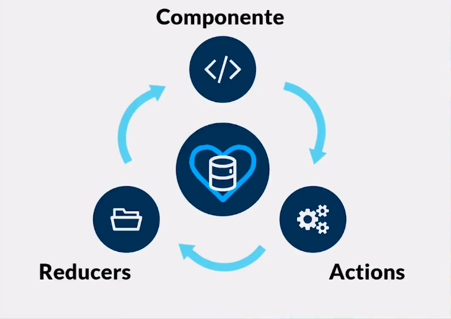

###algunos datos generales
podemos elegir a que componentes entregar un estado que almacena redux.  
cuando conviene usarlo? cuando sean muchos componentes.  
deberia usarlo para estilos css? no , para esto deberia usar archivos locales globales por ejemplo

#Bases de REDUX

- basicos
  - store (almacenamiento)
  - reducer (estados para entregar o almacenar)
  - action creators (funciones para pedir informaciones)
  - componentes (codigo jsx o componentes de interfaz)

#Ciclo de vida en Redux?

